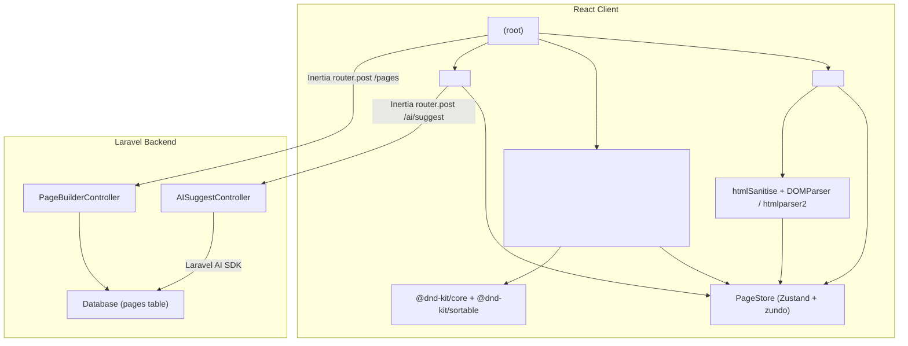

# Design Document: Visual Page Builder

## Overview

The Visual Page Builder is a client-side React component embedded in a Laravel 13 + Inertia.js 3 application. It provides a three-panel WYSIWYG editing environment: a left Sidebar for adding elements, a centre Canvas for live preview and inline editing, and a right Inspector for style controls.

All page state lives in a Zustand store (`PageStore`) with `zundo` temporal middleware for undo/redo. The page is modelled as a typed `SectionNode` tree that serialises cleanly to JSON. On publish, the tree is POSTed to a Laravel controller via `Inertia.router.post`. No separate backend is needed for the builder itself.

Key design decisions:
- SectionNode tree (not raw HTML strings) is the single source of truth, enabling clean serialisation, undo/redo, and inspector targeting.
- Responsive simulation uses scoped CSS container queries injected at runtime rather than browser viewport media queries, so the canvas can simulate breakpoints independently of the browser window size.
- HTML sanitisation happens before parsing, not after, so no script content ever enters the SectionNode tree.
- The `htmlparser2` library is bundled as a fallback for environments where `DOMParser` is unavailable or fails.

---

## Architecture



### Data Flow

1. User interactions (add preset, drag primitive, inline edit, inspector change) dispatch actions to `PageStore`.
2. `PageStore` mutates the `SectionNode` tree; `zundo` records the snapshot.
3. `Canvas` re-renders the affected subtree via Zustand selectors.
4. On "Publish", `PageStore.exportSchema()` serialises the tree and `Inertia.router.post` sends it to `PageBuilderController`.

---

## Components and Interfaces

### `<PageBuilder />`

Root component. Mounts the three-panel layout, registers global keyboard listeners for undo/redo, and provides the DnD context.

```tsx
interface PageBuilderProps {
  initialSchema?: PageSchema;   // optional pre-loaded page
  publishUrl: string;           // Inertia route for publish POST
  aiSuggestUrl: string;         // Inertia route for AI suggest POST
}
```

### `<Sidebar />`

Left panel (240px). Two sections:
- Preset list: Hero, Features, CTA — each rendered as a clickable card.
- Primitives list: Text, Heading, Image, Video, Button, Divider, Container, Spacer — each is a draggable source via `@dnd-kit/core`.
- "Paste HTML" button that opens `<HtmlImportModal />`.

### `<Canvas />`

Centre panel. Renders the `SectionNode` tree recursively via `<SectionRenderer />`. Wraps top-level sections in a `<SortableContext>` for vertical reorder. Applies a scoped container-query stylesheet for responsive simulation.

```tsx
interface CanvasProps {
  viewport: Viewport;  // drives the injected container-query CSS
}
```

### `<SectionRenderer node={SectionNode} />`

Recursive renderer. For each node:
- Merges `node.classes` and `node.overrides[activeBreakpoint]` into the element's `style` prop.
- Sets `contenteditable` on text-bearing tags.
- Renders a `<SectionHeader />` bar above top-level sections.
- Renders a selection outline overlay when `node.id === selectedNodeId`.

### `<SectionHeader />`

Toolbar rendered above each top-level section. Contains: label, collapse toggle, duplicate button, delete button. Not included in `exportSchema()` output.

### `<Inspector />`

Right panel (320px). Three tabs: Content, Style, Layout. Reads the selected `SectionNode` from `PageStore` and renders contextual controls. Dispatches `updateNode` on every control change. Includes "AI Suggest" button for text-bearing nodes.

### `<HtmlImportModal />`

Modal with a `<textarea>` and "Import" button. On import: sanitises → parses → dispatches `importHtmlSection`.

### `<Toolbar />`

Top bar. Viewport toggle (mobile/tablet/desktop icons), Undo/Redo buttons, Publish button.

### `PageStore` (Zustand)

```ts
interface PageState {
  sections: SectionNode[];
  selectedNodeId: NodeId | null;
  viewport: Viewport;

  // actions
  addSection(node: SectionNode): void;
  removeSection(id: NodeId): void;
  reorderSections(fromIndex: number, toIndex: number): void;
  updateNode(id: NodeId, patch: Partial<SectionNode>): void;
  selectNode(id: NodeId): void;
  deselectNode(): void;
  setViewport(v: Viewport): void;
  importHtmlSection(html: string): void;
  duplicateSection(id: NodeId): void;
  exportSchema(): PageSchema;
}
```

`zundo` wraps the store with `temporal` middleware. History limit: 50 entries.

### HTML Utilities

```ts
// sanitise.ts
function sanitiseHtml(raw: string): string
  // strips <script>, on* attrs, javascript: URIs

// parser.ts
function parseHtmlToNodes(html: string): SectionNode[]
  // tries DOMParser first, falls back to htmlparser2

// serialiser.ts
function serialiseNodes(nodes: SectionNode[]): string
  // pretty-prints SectionNode tree back to HTML
```

---

## Data Models

### `SectionNode`

```ts
type NodeId = string;  // nanoid(10)

type Viewport = 'mobile' | 'tablet' | 'desktop';

interface SectionNode {
  id: NodeId;
  type: 'preset' | 'custom-html' | 'scratch';
  tag: string;                              // e.g. 'section', 'div', 'h1', 'p'
  textContent?: string;
  attrs?: Record<string, string>;           // non-style HTML attributes
  classes: string[];                        // Tailwind class list
  overrides: {
    base?: React.CSSProperties;
    sm?: React.CSSProperties;
    md?: React.CSSProperties;
    lg?: React.CSSProperties;
  };
  children: SectionNode[];
}
```

### `PageSchema`

```ts
interface PageSchema {
  version: 1;
  sections: SectionNode[];
}
```

`PageSchema` is the payload POSTed to `PageBuilderController`. It contains no React refs, no DOM nodes, and no circular references.

### Breakpoint → Override Key Mapping

| Viewport  | Canvas width | Override key |
|-----------|-------------|--------------|
| desktop   | 100%        | `base`       |
| tablet    | 768px       | `md`         |
| mobile    | 375px       | `sm`         |

### Preset Defaults

Each preset ships as a static `SectionNode` factory:

```ts
// presets/hero.ts
export function createHeroSection(): SectionNode { ... }

// presets/features.ts
export function createFeaturesSection(): SectionNode { ... }

// presets/cta.ts
export function createCtaSection(): SectionNode { ... }
```

### Primitive Defaults

Each primitive ships as a minimal `SectionNode` factory:

```ts
// primitives/index.ts
export const primitiveFactories: Record<PrimitiveType, () => SectionNode> = {
  text:      () => ({ tag: 'p',      type: 'scratch', ... }),
  heading:   () => ({ tag: 'h2',     type: 'scratch', ... }),
  image:     () => ({ tag: 'img',    type: 'scratch', ... }),
  video:     () => ({ tag: 'video',  type: 'scratch', ... }),
  button:    () => ({ tag: 'button', type: 'scratch', ... }),
  divider:   () => ({ tag: 'hr',     type: 'scratch', ... }),
  container: () => ({ tag: 'div',    type: 'scratch', ... }),
  spacer:    () => ({ tag: 'div',    type: 'scratch', classes: ['h-8'], ... }),
};
```

### Laravel Backend Models

```php
// app/Models/Page.php
class Page extends Model {
    protected $casts = ['schema' => 'array'];
    // columns: id, title, schema (json), published_at, timestamps
}
```

```php
// app/Http/Controllers/PageBuilderController.php
class PageBuilderController extends Controller {
    public function publish(Request $request): \Inertia\Response { ... }
}

// app/Http/Controllers/AISuggestController.php
class AISuggestController extends Controller {
    public function suggest(Request $request): JsonResponse { ... }
}
```

---

## Correctness Properties

*A property is a characteristic or behavior that should hold true across all valid executions of a system — essentially, a formal statement about what the system should do. Properties serve as the bridge between human-readable specifications and machine-verifiable correctness guarantees.*


### Property 1: SectionNode uniqueness invariant

*For any* sequence of node creation operations (addSection, importHtmlSection, duplicateSection, dropping a primitive), all NodeIds present in the PageStore's section tree must be distinct — no two nodes share the same id.

**Validates: Requirements 2.3, 5.3**

---

### Property 2: PageStore serialisation round-trip

*For any* page state, `JSON.parse(JSON.stringify(store.exportSchema()))` must produce an object deeply equal to `store.exportSchema()` — the schema contains no circular references, no React component references, and no DOM node references.

**Validates: Requirements 2.5, 11.2, 11.3**

---

### Property 3: SectionNode structural invariant

*For any* SectionNode created by any factory, import, or duplication, the node must have all required fields: `id` (non-empty string), `type` (one of `preset | custom-html | scratch`), `tag` (non-empty string), `classes` (array), `overrides` (object), and `children` (array).

**Validates: Requirements 2.2, 4.4**

---

### Property 4: Store state setter correctness

*For any* NodeId passed to `selectNode`, the store's `selectedNodeId` must equal that id afterwards. *For any* Viewport value passed to `setViewport`, the store's `viewport` must equal that value afterwards. *For any* call to `deselectNode`, the store's `selectedNodeId` must be `null`.

**Validates: Requirements 3.2, 3.3**

---

### Property 5: Preset addition appends correct type

*For any* preset type (Hero, Features, CTA), clicking it in the Sidebar must result in a new SectionNode of `type: 'preset'` appended at the end of the sections array, with non-empty `classes` and `children`.

**Validates: Requirements 4.2, 4.4**

---

### Property 6: Section reorder correctness

*For any* sections array and any valid pair of indices `(from, to)`, calling `reorderSections(from, to)` must produce a new array that is a permutation of the original with the element at `from` now at `to`, and all other elements in their relative order.

**Validates: Requirements 5.6**

---

### Property 7: Delete removes section and all descendants

*For any* SectionNode in the tree (at any depth), after calling `removeSection(id)`, neither that node's id nor any of its descendants' ids must appear anywhere in the store's section tree.

**Validates: Requirements 5.4**

---

### Property 8: Duplicate produces new unique NodeIds

*For any* section, calling `duplicateSection(id)` must insert a new section immediately after the original where every NodeId in the duplicate's subtree differs from every NodeId in the original's subtree and from every other NodeId in the store.

**Validates: Requirements 5.3**

---

### Property 9: Export schema excludes UI-only metadata

*For any* page state, `exportSchema()` must return a `PageSchema` whose `sections` array contains no section-header metadata, no collapse state, and no selection state — only the pure `SectionNode` tree fields.

**Validates: Requirements 5.7, 11.2**

---

### Property 10: contenteditable applied to text-bearing nodes only

*For any* rendered SectionNode, if its `tag` is one of `h1–h6, p, span, a, li, button` then the rendered DOM element must have `contenteditable="true"`. If its `tag` is `img`, `video`, or `div`, the rendered element must NOT have `contenteditable`.

**Validates: Requirements 6.1, 6.3**

---

### Property 11: Inspector override applied to correct breakpoint key

*For any* active Viewport, when an Inspector control changes a style property, the PageStore must store the new value under the correct key in `node.overrides`: `base` for desktop, `md` for tablet, `sm` for mobile. The other breakpoint keys must remain unchanged.

**Validates: Requirements 7.9, 7.12, 10.5**

---

### Property 12: Reset removes property from overrides

*For any* SectionNode and any style property that exists in its `overrides`, triggering "Reset to default" for that property must result in the property being absent from `overrides` (not set to `undefined` or `null` — fully removed).

**Validates: Requirements 7.10**

---

### Property 13: HTML sanitisation removes all script content

*For any* HTML string, `sanitiseHtml(html)` must return a string that: (a) contains no `<script` substrings, (b) contains no `on\w+=` attribute patterns, and (c) contains no `javascript:` URI schemes in any attribute value.

**Validates: Requirements 8.2, 15.1, 15.2, 15.3**

---

### Property 14: Imported HTML stored as SectionNode tree, not raw HTML

*For any* HTML string passed to `importHtmlSection`, the resulting section in the PageStore must have `type: 'custom-html'` and must not contain any field holding a raw HTML string — all content must be represented as `SectionNode` fields.

**Validates: Requirements 8.4**

---

### Property 15: HTML parser round-trip

*For any* valid HTML snippet, `parseHtmlToNodes(serialiseNodes(parseHtmlToNodes(html)))` must produce a SectionNode array structurally equivalent to `parseHtmlToNodes(html)` — same tags, textContent, attrs, classes, and tree structure.

**Validates: Requirements 12.1, 12.2, 12.3**

---

### Property 16: Script tags absent from parsed SectionNode tree

*For any* HTML string containing `<script>` elements, after sanitisation and parsing, the resulting SectionNode tree must contain no node with `tag === 'script'` at any depth.

**Validates: Requirements 12.4, 15.1, 15.3**

---

### Property 17: Primitive drop into Container appends as child

*For any* Container SectionNode and any primitive type, dropping the primitive into the container must result in the primitive appearing as the last element of the container's `children` array, with a unique NodeId and `type: 'scratch'`.

**Validates: Requirements 9.3**

---

### Property 18: Primitive drop between sections creates scratch section

*For any* drop position between two top-level sections, dropping a primitive must create a new top-level SectionNode of `type: 'scratch'` at that position containing the primitive as its sole child.

**Validates: Requirements 9.4**

---

### Property 19: Undo/redo round-trip

*For any* sequence of state mutations, applying undo then redo must restore the store to the state it was in before the undo — the undo/redo pair is a round-trip identity operation.

**Validates: Requirements 13.2, 13.3**

---

### Property 20: Undo reverts last mutation

*For any* sequence of mutations M1…Mn, after calling undo once, the store's state must equal the state after M1…M(n-1) was applied.

**Validates: Requirements 13.2**

---

## Error Handling

### HTML Import Errors

- If `DOMParser` throws or returns a document with only a `parseerror` element, the builder falls back to `htmlparser2`.
- If `htmlparser2` also fails, `importHtmlSection` dispatches no state change and the `<HtmlImportModal />` displays a descriptive error message.
- Sanitisation errors (malformed input) are caught; the raw string is rejected and the user is notified.

### Publish Errors

- `Inertia.router.post` failure (network error, 422, 500) is caught in the `onError` callback.
- The `PageStore` state is not mutated on failure.
- A toast notification is displayed with the error message.
- The user can retry without losing any work.

### AI Suggest Errors

- Network or server errors from the AI suggest endpoint are caught.
- The `SectionNode.textContent` is not modified.
- The Inspector displays an inline error message and re-enables the "AI Suggest" button.

### Undo/Redo Boundary Errors

- When `undo` is called with no history, `zundo` stays at the earliest snapshot — no error is thrown.
- When `redo` is called with no future history, `zundo` stays at the latest snapshot — no error is thrown.

### Viewport Simulation

- If a container-query stylesheet injection fails (e.g., CSP restriction), the canvas falls back to rendering at full width with a console warning.

---

## Testing Strategy

### Dual Testing Approach

Both unit tests and property-based tests are required. They are complementary:
- Unit tests cover specific examples, integration points, and error conditions.
- Property-based tests verify universal correctness across all inputs.

### Property-Based Testing

**Library**: `fast-check` (TypeScript/JavaScript PBT library).

Each property-based test must:
- Run a minimum of 100 iterations (`numRuns: 100` in `fc.assert`).
- Be tagged with a comment referencing the design property.
- Tag format: `// Feature: visual-page-builder, Property N: <property_text>`

Each correctness property listed above must be implemented by exactly one property-based test.

**Arbitraries to define**:
- `fc.record(...)` for `SectionNode` with constrained `tag`, `type`, `classes`, `overrides`, `children` (recursive, depth-limited to 4).
- `fc.string()` filtered for valid HTML snippets.
- `fc.constantFrom('mobile', 'tablet', 'desktop')` for Viewport.
- `fc.constantFrom('Hero', 'Features', 'CTA')` for preset types.

**Example property test structure**:

```ts
// Feature: visual-page-builder, Property 2: PageStore serialisation round-trip
it('exportSchema round-trips through JSON', () => {
  fc.assert(fc.property(arbitrarySectionNodeArray(), (sections) => {
    const store = createTestStore(sections);
    const schema = store.exportSchema();
    const roundTripped = JSON.parse(JSON.stringify(schema));
    expect(roundTripped).toEqual(schema);
  }), { numRuns: 100 });
});
```

### Unit Tests

Unit tests should cover:
- Rendering: Sidebar lists all presets and primitives (Req 4.1, 9.1).
- Keyboard shortcuts: Ctrl+Z triggers undo, Ctrl+Shift+Z triggers redo (Req 3.6, 3.7).
- Inline editing: blur commits textContent, debounce at 150ms (Req 6.5, 6.6).
- Click outside deselects (Req 6.7).
- Selection outline rendered on selected element (Req 6.8).
- Inspector tabs render (Req 7.1).
- HtmlImportModal opens on "Paste HTML" click (Req 8.1).
- DOMParser fallback to htmlparser2 (Req 12.5).
- Undo history limit of 50 (Req 13.4).
- Undo at boundary stays at earliest state (Req 13.5).
- AI Suggest button visible for text nodes (Req 14.1).
- AI Suggest POST payload (Req 14.2).
- AI suggestion preview and confirmation (Req 14.3, 14.4).
- AI request failure retains original textContent (Req 14.5).
- Publish POST via Inertia (Req 11.4).
- Publish failure shows error without losing state (Req 11.6).
- InertiaController rejects script-bearing schema (Req 15.4) — Laravel feature test.

### Test Framework

- **Frontend**: Vitest + React Testing Library + `fast-check`.
- **Backend**: PHPUnit (Laravel feature tests for `PageBuilderController` and `AISuggestController`).

### Test File Structure

```
resources/js/
  components/page-builder/
    __tests__/
      PageStore.test.ts          # unit + property tests for store
      sanitise.test.ts           # property tests for sanitisation
      parser.test.ts             # property tests for round-trip
      SectionRenderer.test.tsx   # unit tests for rendering
      Inspector.test.tsx         # unit tests for inspector
      Canvas.test.tsx            # unit tests for canvas interactions

tests/Feature/
  PageBuilderControllerTest.php  # publish + validation
  AISuggestControllerTest.php    # AI suggest endpoint
```
